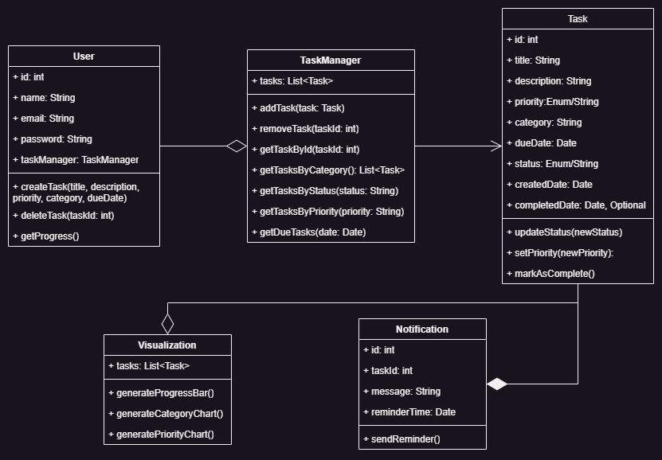

# Taskova

<a href="https://github.com/figuran04/taskova" target="blank">Download</a>

Taskova merupakan aplikasi manajemen tugas yang dirancang untuk membantu pengguna dalam mengorganisasi, memprioritaskan, dan menyelesaikan berbagai aktivitas secara efisien. Dengan memanfaatkan konsep Pemrograman Berorientasi Objek (OOP) dalam pengembangannya, Taskova menawarkan sistem yang modular dan mudah dikembangkan.

### Diagram Kelas

Diagram kelas merupakan representasi visual struktur utama aplikasi yang dirancang untuk memenuhi kebutuhan fungsionalitas. Diagram ini mencakup identifikasi kelas utama, atribut, metode, serta hubungan antar kelas. Diagram kelas dari aplikasi Taskova dapat dilihat pada gambar berikut.

### Kelas Utama

1. Task: Kelas ini merepresentasikan setiap tugas yang dikelola dalam aplikasi.
2. Kelas TaskManager: Mengelola kumpulan tugas pengguna.
3. Kelas User: Mewakili pengguna aplikasi.
4. Kelas Notification: Menangani pemberitahuan dan pengingat tugas.
5. Kelas Visualization: Menyediakan fitur visualisasi data.

### Hubungan Antar Kelas

1. Asosiasi: TaskManager ↔ Task (TaskManager mengelola daftar Task).
2. Agregasi: User ↔ TaskManager, TaskManager ↔ Visualization (Visualisasi hanya membaca data dari TaskManager).
3. Komposisi: Task ↔ Notification (Notifikasi bergantung pada keberadaan Task).

### Daftar Fitur Utama

1. Penambahan, Pencarian, dan Penghapusan Tugas

- Membantu pengguna untuk menambah, mencari, dan menghapus tugas.
- Kelas terkait: TaskManager.

2. Mengatur Prioritas dan Kategori Tugas

- Memudahkan pengguna untuk mengelompokkan tugas berdasarkan kategori dan prioritas.
- Kelas terkait:Task

3. Pengaturan Tenggat Waktu dan Pengingat

- Memberikan pengingat otomatis untuk tugas mendekati tenggat waktu.
- Kelas Terkait: Notification, Task.

4. Visualisasi Progres Tugas Pengguna

- Menampilkan progres dalam bentuk grafik atau diagram untuk memotivasi pengguna.
- Kelas Terkait: Visualization, TaskManager.

### Hubungan Fitur dan Kelas

Hubungan fitur dan kelas dapat dilihat pada tabel di bawah ini:

| Fitur                              | Deskripsi                                            | Kelas yang Terlibat        |
| ---------------------------------- | ---------------------------------------------------- | -------------------------- |
| Penambahan, pencarian, penghapusan | Pengelolaan tugas: tambah, hapus, cari.              | TaskManager                |
| Mengatur prioritas dan kategori    | Penentuan prioritas tugas, pengelompokan kategori.   | Task                       |
| Pengaturan tenggat waktu/pengingat | Mengelola pengingat untuk tugas tertentu.            | Notification, Task         |
| Visualisasi progres                | Menampilkan progres tugas dalam grafik atau diagram. | Visualization, TaskManager |

### Taskova Perview

[Review lebih lanjut](https://figuran04.github.io/taskova)

<VPTeamPage>
  <VPTeamPageTitle>
    <template #title>
      Tim Kami
    </template>
    <template #lead>
      Pengembangan BarangKu dibangun oleh tim mahasiswa Teknologi Informasi, semuanya telah memilih untuk ditampilkan di bawah ini.
    </template>
  </VPTeamPageTitle>
  <VPTeamMembers
    :members="members"
  />
</VPTeamPage>
